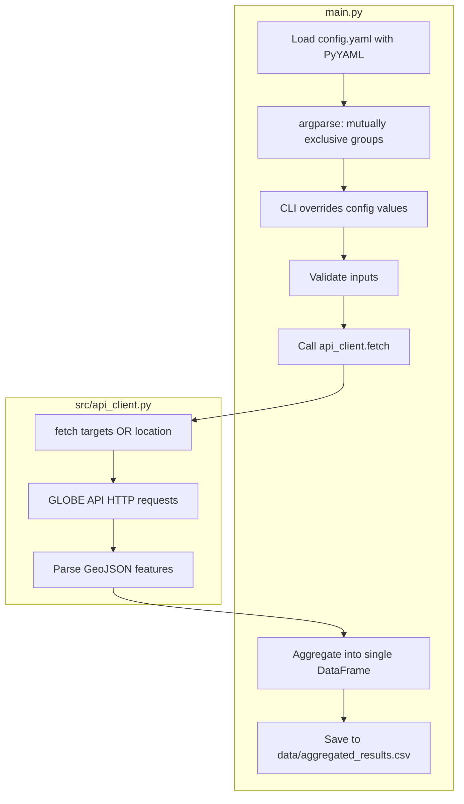

# main.py GLOBE CLI Implementation Plan

## Current State

- **No `src/` folder or `api_client.py`** exist yet; both must be created.
- [config.yaml](config.yaml) defines: `api.base_url`, `api.timeout`, `search_defaults`, `targets.teams/usernames`, `location.lat/lon`, `output.directory/filename`.
- [notebooks/main.ipynb](notebooks/main.ipynb) shows working GLOBE API calls for team, user, and location-based search using `https://api.globe.gov/search/v1/measurement/protocol/measureddate/` endpoints.
- No `requirements.txt`; project uses Python 3.x and pandas/requests in the notebook.

---

## Architecture




---

## 1. Create `src/api_client.py`

**Purpose:** Encapsulate GLOBE API calls. Called by `main.py` with validated inputs.

**Interface:**

```python
def fetch(
    mode: Literal["targets", "location"],
    targets: list[str] | None = None,  # teams and/or usernames
    lat: float | None = None,
    lon: float | None = None,
    radius_km: float | None = None,
    start_date: str | None = None,
    end_date: str | None = None,
    base_url: str = "...",
    timeout: int = 30,
) -> pd.DataFrame | None
```

**Implementation notes:**

- Use GLOBE API patterns from the notebook (e.g. `globeteams/?teams=`, `userid/?userid=`, `point/distance/?lat=&lon=&distancekm=`).
- For `targets`: iterate over each target; try as team first, then as user if needed (or treat as mixed list; GLOBE distinguishes by endpoint).
- Return `pd.DataFrame` with GeoJSON features flattened; return `None` or empty `DataFrame` on API failure or no data.
- Use relative paths / project-root resolution per [python-pipeline.mdc](.cursor/rules/python-pipeline.mdc).

---

## 2. Create `main.py` (project root)

**Configuration (PyYAML):**

- Load `config.yaml` from project root (path via `Path(__file__).resolve().parent / "config.yaml"`).
- Default `end_date` to `date.today().isoformat()` if `null` in config.

**CLI (argparse):**

- Mutually exclusive group:
  - **Group A:** `--targets TEAM1 TEAM2 USER1 ...` (nargs='+') — list of teams and usernames.
  - **Group B:** `--lat LAT --lon LON --radius RADIUS_KM` — all three required together.
- Optional args: `--start-date`, `--end-date`, `--output` (override output path).
- If neither group is provided, fall back to config values (`targets` from `targets.teams` + `targets.usernames`, or `location` from `location` + `search_defaults.radius_km`).

**Input precedence:**

- CLI args override corresponding config values; otherwise use config.

**Retrieval & aggregation:**

1. Validate: exactly one of (targets, location) active.
2. Call `src.api_client.fetch(...)` with merged config + CLI values.
3. Collect results; if multiple targets, aggregate into a single `DataFrame` via `pd.concat` (with `ignore_index=True`).

**Persistence:**

- Ensure `data/` exists (`Path("data").mkdir(parents=True, exist_ok=True)`).
- Save to `data/aggregated_results.csv` (config `output.filename` can override if desired; plan uses `aggregated_results.csv` per user example).

**Error handling:**

- `try/except` around API calls; catch `requests.RequestException` and `ConnectionError`.
- If API unreachable: log error, exit with non-zero code (or return empty DataFrame and warn).
- If a target or location returns no data: skip that target, continue with others; do not fail the whole run.
- Handle empty aggregated result: save empty CSV or warn and exit gracefully.

---

## 3. Dependencies

Create `requirements.txt` with:

```
PyYAML>=6.0
pandas>=2.0
requests>=2.28
```

---

## 4. File Layout (Result)

```
udea-0311152-01-nubosidad/
├── main.py              # CLI entry point
├── config.yaml          # (existing)
├── requirements.txt     # (new)
├── data/
│   └── aggregated_results.csv   # output
└── src/
    ├── __init__.py      # (empty, for package)
    └── api_client.py    # GLOBE API client
```

---

## 5. Usage Examples

```bash
# Targets mode (CLI overrides config)
python main.py --targets Udea0311152 student_01

# Location mode
python main.py --lat 6.26 --lon -75.56 --radius 5

# Use config defaults (no args)
python main.py

# With date override
python main.py --targets Udea0311152 --start-date 2026-01-01 --end-date 2026-02-28
```

---

## 6. Open Design Choice

**Target handling:** The config separates `targets.teams` and `targets.usernames`. With a single `--targets` flag, two options:

- **Option A:** Single flat list `--targets Udea0311152 student_01`; api_client treats each item as either team or user (e.g., convention or separate API calls).
- **Option B:** Two CLI flags `--teams` and `--usernames` in the same group, both optional; at least one target type required in Group A.

Recommendation: **Option A** (flat `--targets`) for simpler CLI; api_client will query team and user endpoints as needed per item.

Selected choice: Option A