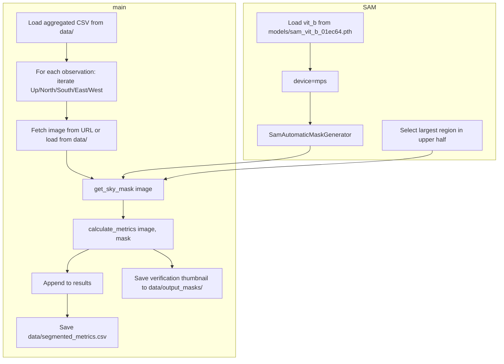

# SAM Sky Segmenter Implementation Plan

## Context

- [data/aggregated_globe_data.csv](data/aggregated_globe_data.csv) contains GLOBE sky observations with photo URLs per direction: `skyconditionsUpwardPhotoUrl`, `skyconditionsNorthPhotoUrl`, `skyconditionsSouthPhotoUrl`, `skyconditionsEastPhotoUrl`, `skyconditionsWestPhotoUrl`.
- [PROJECT_CONTEXT.md](PROJECT_CONTEXT.md): Hypothesis is B/(R+G) index correlates with atmospheric transparency.
- [.cursor/rules/python-pipeline.mdc](.cursor/rules/python-pipeline.mdc): Use `torch.device('mps')` for M3 Max, relative paths, type hints.
- [requirements.txt](requirements.txt) already includes `segment-anything>=1.0`.

---

## Architecture




---

## 1. Data Discovery and Multi-Directional Processing

**Input source:** Read `data/aggregated_globe_data.csv` (or configurable path via argparse/config).

**Column mapping:**


| Direction | CSV Column                  |
| --------- | --------------------------- |
| Up        | skyconditionsUpwardPhotoUrl |
| North     | skyconditionsNorthPhotoUrl  |
| South     | skyconditionsSouthPhotoUrl  |
| East      | skyconditionsEastPhotoUrl   |
| West      | skyconditionsWestPhotoUrl   |


**Exclusions:**

- Do not process `skyconditionsDownwardPhotoUrl` (Down).
- Do not process images tagged as Ground or Calibration: skip when corresponding `*Caption` column (e.g. `skyconditionsUpwardCaption`) contains "ground" or "calibration" (case-insensitive).
- Skip URLs that are empty, `"pending approval"`, `"null"`, or otherwise invalid.

**Image loading:** For each valid URL, fetch via `requests.get()` and load with `PIL.Image` or `cv2.imread` (decode to RGB numpy array HWC uint8). Optionally support local paths in `data/` if a file exists (e.g. `data/images/{observation_id}_{direction}.jpg`); if not, fetch from URL.

**Graceful handling:** If a direction has no valid URL or fetch fails, log a warning and continue to the next image/observation.

---

## 2. Model Setup (CRITICAL)

- **Checkpoint:** Load from `./models/sam_vit_b_01ec64.pth` (relative to project root).
- **Device:** Use `device = torch.device("mps")` for M3 Max GPU. Wrap model: `model.to(device)`. SamPredictor/SamAutomaticMaskGenerator uses the model's device internally.
- **Fallback:** If MPS is unavailable, fall back to CPU (log warning).
- **API:**

```python
  from segment_anything import sam_model_registry, SamAutomaticMaskGenerator
  sam = sam_model_registry["vit_b"](checkpoint="models/sam_vit_b_01ec64.pth")
  sam.to(device)
  mask_generator = SamAutomaticMaskGenerator(sam)
  

```

---

## 3. Segmentation Logic: `get_sky_mask()`

- **Input:** `image: np.ndarray` (HWC, uint8, RGB).
- **Process:** Call `mask_generator.generate(image)` to get list of masks.
- **Heuristic:** Select the "Sky Mask" as:
  1. Filter masks whose centroid or bbox center lies in the upper half of the frame (`y_center < H / 2`).
  2. Among those, pick the mask with the largest `area`.
- **Output:** Return binary mask `np.ndarray` (H, W), or `None` if no suitable mask found (log warning).

---

## 4. Metric Calculation: `calculate_metrics()`

- **Input:** `image: np.ndarray` (HWC RGB uint8), `mask: np.ndarray` (HW bool).
- **Steps:**
  1. Extract RGB of masked pixels: `R = image[mask, 0]`, `G = image[mask, 1]`, `B = image[mask, 2]`.
  2. Compute per-pixel Sky Index: `index = B / (R + G + eps)` (add small `eps` to avoid division by zero).
  3. Compute `mean_index`, `std_dev`, `mask_pixel_count`.
- **Output:** `dict` with `mean_index`, `std_dev`, `mask_pixel_count`.

---

## 5. Data Output

**CSV:** `data/segmented_metrics.csv` with columns:

- `observation_id`
- `timestamp` (from `skyconditionsMeasuredAt`)
- `direction` (Up, North, South, East, West)
- `mean_index`
- `std_dev`
- `mask_pixel_count`

**Verification thumbnails:** For each processed image, save to `data/output_masks/` a thumbnail showing original image with sky mask overlaid (e.g. semi-transparent green overlay). Naming: `{observation_id}_{direction}.png` or similar. Resize if needed for reasonable file size.

---

## 6. Modular Structure

```
src/sam_segmenter.py
├── load_sam_model(checkpoint_path, device) -> SamAutomaticMaskGenerator
├── get_sky_mask(image, mask_generator) -> np.ndarray | None
├── calculate_metrics(image, mask) -> dict
├── load_image_from_url(url) -> np.ndarray | None
├── save_verification_thumbnail(image, mask, output_path)
├── collect_observations_from_csv(csv_path) -> list of (obs_id, timestamp, direction, url)
└── main() -> orchestrates loop, writes CSV and thumbnails
```

Use a `main()` function to:

1. Resolve project root and paths (no hardcoding; use `Path(__file__).resolve().parent.parent` for project root).
2. Load config (optional, for CSV path, model path, output paths).
3. Load SAM model on MPS.
4. Load CSV, iterate observations and directions.
5. For each valid image: fetch, get sky mask, calculate metrics, save thumbnail, append row.
6. Write `data/segmented_metrics.csv`.
7. Create `data/output_masks/` if it does not exist.

---

## 7. Dependencies and Config

**New dependencies:** Add to [requirements.txt](requirements.txt):

- `torch` (for SAM; segment-anything depends on it)
- `torchvision`
- `opencv-python` or `pillow` for image I/O and overlays
- `numpy` (likely already transitive)

**Config:** Add to [config.yaml](config.yaml) (optional):

```yaml
sam:
  checkpoint: "models/sam_vit_b_01ec64.pth"
  device: "mps"
segmentation:
  input_csv: "data/aggregated_globe_data.csv"
  output_csv: "data/segmented_metrics.csv"
  output_masks_dir: "data/output_masks"
```

---

## 8. File Layout (Result)

```
udea-0311152-01-nubosidad/
├── models/
│   └── sam_vit_b_01ec64.pth   # User must download (not in repo)
├── data/
│   ├── aggregated_globe_data.csv
│   ├── segmented_metrics.csv   # Output
│   └── output_masks/           # Verification thumbnails
└── src/
    └── sam_segmenter.py
```

---

## 9. Error Handling Summary

- MPS unavailable: fallback to CPU, log warning.
- Checkpoint missing: raise clear error with instructions to download.
- Invalid/missing URL: log warning, skip image.
- Fetch failure: log warning, skip image.
- No sky mask found: log warning, skip row for that image (or write row with NaN/empty metrics).
- Empty CSV: exit gracefully after logging.

